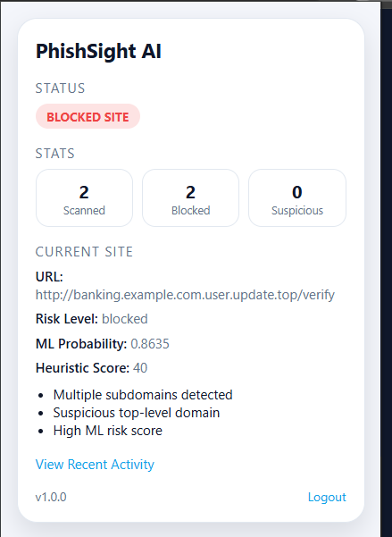
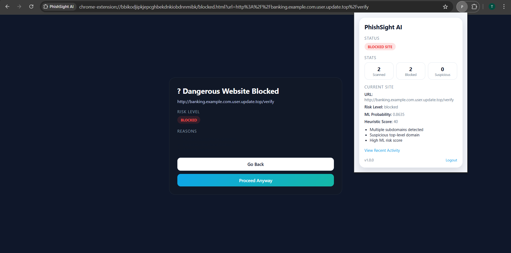

# PhishSight AI

PhishSight AI is a product-style phishing protection extension with automatic background scanning, ML + heuristic scoring, and real-time blocking. The extension is self-contained: users onboard with email once and protection runs silently in the background.

## Architecture
**System overview**



**Extension UI**



**Blocking Page**


## Components
- **Chrome Extension (MV3)**: Onboarding, background scanning, badge updates, and blocking UI.
- **Node.js Backend**: Auth, URL checks, logging, and stats aggregation.
- **Python ML API (Flask)**: Model inference endpoint.
- **MongoDB**: Stores users and URL logs.

## Data Flow
1. Extension detects active tab URL.
2. Extension calls `/api/check-url` with JWT.
3. Backend calls ML API `/predict`.
4. Backend combines ML + heuristic scoring.
5. Result is stored in MongoDB and returned to the extension.
6. Extension updates badge, popup UI, and blocks unsafe pages.

## Repository Structure
```
root/
  extension/
  backend/
  ml-service/
```

## Local Development
**Prerequisites**
- Node.js 18+ (or 20+)
- Python 3.10+
- Docker Desktop (for MongoDB) or local MongoDB

**MongoDB (Docker)**
```bash
docker run -d -p 27017:27017 --name mongo mongo:7
```

**ML API**
```bash
cd ml-service
python -m venv .venv
.\.venv\Scripts\activate
python -m pip install -r requirements.txt
python train.py --data data/sample_urls.csv --output model.pkl
python app.py
```

**Backend**
```bash
cd backend
npm install
npm run dev
```

**Extension**
1. Open `chrome://extensions`
2. Enable Developer Mode
3. Load unpacked ? select `extension/`

## Environment Variables
**Backend** (`backend/.env`)
| Variable | Description | Example |
| --- | --- | --- |
| `PORT` | Backend port | `5000` |
| `MONGODB_URI` | MongoDB connection string | `mongodb://127.0.0.1:27017/phishsight` |
| `JWT_SECRET` | JWT signing key | `change_this_secret` |
| `ML_API_URL` | ML API predict endpoint | `http://127.0.0.1:8000/predict` |
| `CORS_ORIGIN` | Allowed origins | `http://localhost:5174` |

## API Reference
**Email-only onboarding**
- `POST /api/auth/extension-login`

Body:
```json
{ "email": "user@example.com" }
```

Response:
```json
{ "token": "<jwt>", "user": { ... } }
```

**URL check**
- `POST /api/check-url` (protected)

Response:
```json
{
  "ml_probability": 0.91,
  "heuristic_score": 78,
  "verdict": "blocked",
  "reasons": ["..."]
}
```

**User stats**
- `GET /api/user/stats` (protected)

Response:
```json
{
  "pages_scanned": 6241,
  "blocked_count": 3,
  "suspicious_count": 12
}
```

## Extension UX
**Onboarding**
- User enters email once.
- JWT is stored in `chrome.storage.local`.

**Protection**
- Background scans run on tab updates.
- Badge reflects verdict (green/safe, orange/suspicious, red/blocked).
- Blocked pages show reasons and allow safe override by whitelisting the origin.

## Testing Checklist
- Activate extension with email and confirm JWT stored.
- Visit a safe site ? verdict `safe` and green badge.
- Visit a suspicious URL ? verdict `suspicious` and orange badge.
- Visit a phishing-style URL ? verdict `blocked`, blocking page shown.
- Confirm stats update in popup.

## Security Notes
- JWT is stored only in `chrome.storage.local`.
- Token is never exposed in the UI.
- Logout clears all stored auth data.

## License
Proprietary. All rights reserved.
